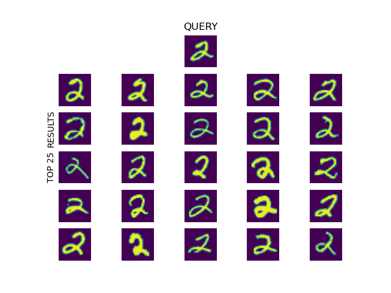

# MNIST Search Trial

A simple idea for a neural search algorithm, which we try on the MNIST dataset.
We train a CNN classifier on the MNIST dataset, then exclude the last (classifying) layer from the network and use this structure as an encoder.
This encoder embeds MNIST images to a latent space on which we perform the search.
We train the network on the MNIST's training data (60k images) and encode the test data (10k images) and store it as our database.
Given a query image (from MNIST) we perform brute-force search on a vector of cosine similarity calculated between the query and the instances of the database, and return top _k_ results.

Some random results:

